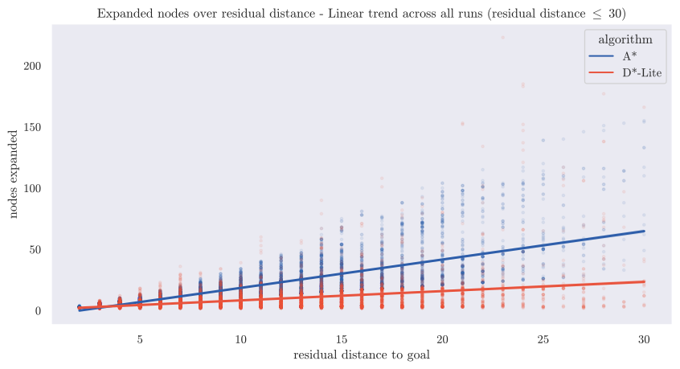
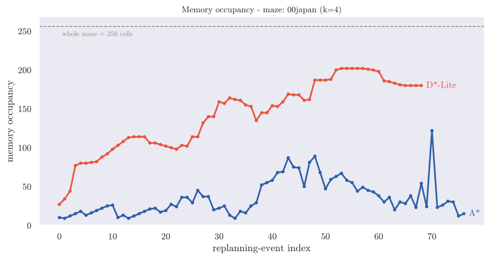

\begin{titlepage}
\centering
\includegraphics[width=0.5\textwidth]{res/logo_unibs.png}\par\vspace{1cm}
{\scshape\Large DIPARTIMENTO DI INGEGNERIA DELL'INFORMAZIONE\par}
\vspace{0.3cm}
{\large Corso di Laurea in Ingegneria Informatica\par}
\vspace{2cm}
{\large Relazione del progetto di Robotica\par}
\vspace{0.6cm}
{\LARGE\bfseries Maze Exploration Search Analysis \par}
\vspace{0.8cm}
{\large Anno di Corso 2025-2026\par}
\vfill

\begin{flushleft}
{\large\textbf{Docente del corso:}\par}
{\large Prof. Enrico Scala\par}
{\large Prof. Luigi Gargioni\par}
\end{flushleft}

\vspace{1cm}

\begin{flushright}
{\large\textbf{Studenti:}\par}
{\large Francesco Guarda\par}
{\large Andrea Moro\par}
\end{flushright}

\vfill

{\footnotesize
\textbf{Licensing Note}\\
This work is licensed under the Creative Commons Attribution 4.0 International License.
Copyright for components of this work owned by other than the authors and the
University of Brescia must be honoured.
}

\end{titlepage}

\tableofcontents
\clearpage

# Introduction

This project treats goal-directed maze exploration as an **online replanning problem**, in the classical Micromouse paradigm: the agent knows the start and goal cells in advance but not the maze layout, and must interleave sensing, (re)planning, and acting to reach the goal while minimizing exploration effort. It adopts the **freespace assumption** — every unexplored cell is optimistically treated as passable until a wall is sensed — with a *replanning event* triggered whenever new information invalidates the current plan. The central question is which replanning strategy handles this sense–plan–act loop most effectively.

Two strategies are implemented against a shared exploration framework and evaluated head-to-head — A\* (full replanning) and D\*-Lite (incremental replanning) — isolating the effect of *how* a plan is repaired when a new wall is discovered. Contributions:

- A shared exploration-algorithm interface (`BaseAlgorithm`/`BaseAPI`) making A\* and D\*-Lite drop-in implementations of one sense-plan-act loop.
- A headless extension of the MMS simulator interface, enabling fully automated, GUI-free batch evaluation at scale.
- Native multi-goal exploration, a first-class capability rather than a special case of single-goal search.
- The **detour index**, a metric for manufacturing exploration difficulty by goal placement rather than by maze selection, extended to nested multi-goal scenarios.
- A 440-run controlled comparison of A\* and D\*-Lite, evaluating D\*-Lite as an *incremental* search algorithm that reuses prior search effort across replanning events, not merely as an alternative exploration heuristic.

# Background

**The Micromouse problem and the MMS simulator.** The Micromouse competition tasks a small autonomous robot with exploring an unknown grid maze from a fixed start to a fixed goal region. This project uses `mms` (mackorone, 2024), which reproduces that setting: a GUI for visualization, driving the algorithm through a text-based `stdin`/`stdout` protocol of wall queries, moves, turns, and display commands. It was adopted for its standard, competition-faithful interface, built-in visualization, and existing Python bindings, extended in this project (§3).

**Search under partial observability.** Under the freespace assumption, an agent plans as if every unsensed cell were open, then repairs its plan when a sensed wall proves otherwise — the optimistic-planning principle behind the D\* family of incremental replanners (Stentz, 1994). A\* (Hart et al., 1968) is the classical heuristic best-first baseline: optimal given an admissible heuristic, but with no memory of a previous search once the map changes. D\*-Lite (Koenig & Likhachev, 2002, 2005) is designed explicitly to reuse previous search results when the environment — or the agent's knowledge of it — changes slightly, rather than resolving the whole problem from scratch.

**Walls representation.** Each cell stores a 4-bit wall bitmask, one bit per cardinal direction (N=1, E=2, S=4, W=8), used identically by the simulator protocol and the internal maze map.

{width=48%}

# Methodology

## A common interface for exploration algorithms

`BaseAPI` is an abstract contract — wall sensing, movement, display, reset — decoupling an exploration algorithm from its I/O backend. `BaseAlgorithm` implements the shared sense → plan → act → log loop on top of it, together with goal resolution (an explicit list, random goals, or a default centre area) and the metrics hooks common to every concrete algorithm. Adding a third algorithm to this project therefore means implementing one class against this interface, with no change to execution, logging, or evaluation tooling.

## Headless execution for automated evaluation

A second backend, `SimAPI`, implements the same `BaseAPI` contract entirely in memory, without the MMS GUI process. This is what makes a large deterministic batch campaign practical: the same algorithm code runs unmodified under either backend, and was cross-checked against the real MMS GUI to confirm behavioural equivalence before the campaign in §4 was run headlessly at scale.

## Exploration algorithms

**A\*** replans from scratch after every newly discovered wall that invalidates the current plan; movement cost is 1 per traversable edge; multi-goal exploration greedily re-targets the nearest remaining goal after each is reached. **D\*-Lite** instead maintains incremental search state (`g`/`rhs` values in a priority queue) across the whole episode: on a newly discovered wall, only the affected region of this state is repaired rather than the whole plan recomputed; a reached goal is retired and the search reinitialised toward the next one while the reusable state built up elsewhere in the maze is kept.

The experimental campaign (§4) fixes **both** algorithms to the Manhattan heuristic: admissible and consistent, O(1) per query rather than a fresh graph search, and matching D\*-Lite's own incremental `km`-based heuristic update — so neither algorithm's node or time counts are confounded by heuristic-recomputation overhead, and the comparison stays isolated to *how* each repairs its plan. This reuse of prior search state is exactly the property under direct scrutiny in §4.3–4.4: D\*-Lite is evaluated as an incremental-search algorithm whose central claimed advantage — cheaper repair versus cheaper-from-scratch replanning — is directly measurable.

## Multi-goal exploration

Goals may be an explicit list, a random sample, or an automatically placed set (§3.5); both algorithms visit them in greedy nearest-goal order, though the search mechanics producing that order differ. A\*'s search is rooted at the current position and terminates at the first goal popped from its open list, discarding all partial information about the other goals once that episode ends. D\*-Lite's search is instead rooted at the *entire* remaining goal set simultaneously (every unreached goal initialised with `rhs = 0`), so once the nearest goal is reached, the `g`/`rhs` state already built toward the others remains valid and is reused directly — an amplification, specific to multi-goal exploration, of the reuse advantage above. With no goals specified, both algorithms fall back to the standard Micromouse 4-cell centre goal area (first arrival ends the run); this default is not used by the experimental campaign, where every scenario is placed automatically (§3.5).

## Modeling exploration difficulty: the detour index

For a reference cell and a candidate cell, the **detour index** is the ratio of true in-maze (BFS) distance to straight-line (Manhattan) distance — a cell that looks close but is actually far behind walls scores highest, exactly the configuration that defeats a greedy planner working from a partial map (the *route factor*/*circuity* of spatial-network analysis: Barthélemy, 2011; Gastner & Newman, 2006). The first goal maximises detour from the start; each additional goal maximises the *minimum* detour over the start and every previously placed goal, so a k-goal scenario stays jointly deceptive; scenarios are **nested** — a k-goal scenario's first j goals equal the j-goal scenario's goals. This metric, not maze selection, is the difficulty axis of the whole campaign (§4.1). Its normalisation has a known bias toward goals close to the start (small denominators score higher almost regardless of true distance); §5 returns to this.

# Experimental Evaluation

## Setup

The corpus is 55 standard Micromouse competition mazes (Weisberg), all 16×16 (256 cells), filtered to guarantee full connectivity from the start so every goal is reachable. Four goal-count scenarios are placed automatically per maze, k = 1..4, by detour-index placement (§3.5). The full factorial, headless batch campaign — 2 algorithms × 55 mazes × 4 scenarios — produced **440 runs**, each logging run-level scalars and a per-event replanning record (nodes expanded, planning time, residual distance to goal, memory occupancy).

Every metric except wall-clock planning time is exactly reproducible run to run: the campaign is a full census of the (algorithm × maze × scenario) space rather than a sample, so the analysis below is descriptive and paired rather than inferential — no p-values or resampling are reported. Planning time is the only quantity with genuine measurement noise. Both algorithms are complete searches under the freespace assumption, so reaching every goal on a fully connected maze is guaranteed rather than a finding; all 440 runs did so.

## Goal-placement difficulty across the maze corpus

Because placement is nested, every k-goal scenario shares the same first goal, and each subsequent goal adds comparably deceptive — not easier or harder — territory by construction, so aggregate exploration effort grows with k across the whole corpus (§4.3–4.5). The first goal's true distance from the start ranges from 5 to 107 steps (median 31) across the corpus. Table 1 spans that range: zigzag, 2015japan and 2017apec place a goal that is both high-scoring and genuinely remote, while museum's goal scores comparably high purely because its Manhattan distance is 1, despite being only 5 real steps away — a pattern that recurs in 26 of the 55 mazes (§5). Figure 2 shows the score map goal placement maximises at each step, k = 1..4, for a representative maze: high-scoring cells sit immediately behind walls close to the reference set.

| Maze | Manhattan dist. | Real (BFS) dist. | Detour score |
|---|---|---|---|
| zigzag | 3 | 107 | 35.7 |
| 2015japan | 3 | 75 | 25.0 |
| 2017apec | 5 | 99 | 19.8 |
| museum | 1 | 5 | 5.0 |

: First-goal (k=1) placement for four representative mazes: zigzag, 2015japan and 2017apec are both high-scoring and genuinely remote; museum is high-scoring only because its Manhattan distance is 1. Every nested k $\ge$ 1 scenario shares this same first goal.

## Replanning cost: nodes expanded and wall-clock planning time

D\*-Lite expands **2.3–3.0× fewer nodes** than A\* at every k and accumulates **2.6–3.1× less** cumulative planning time (Figure 3) — a consistent win on both measures, not a trade-off: fewer nodes in 212 of the 220 matched (maze, k) pairs, lower time in 219 of 220. Nodes expanded is the algorithm-intrinsic, implementation-independent measure of search effort; planning time is useful corroboration but remains hardware/implementation-dependent in principle — here the two agree on every ordering.

{width=82%}

## Search-cost scaling: evidence for incremental reuse

Regressing nodes expanded on residual distance to goal per replanning event (dense band, residual distance $\le$ 30, 99.3% of the 18,176 logged events): A\*'s slope is steeper than D\*-Lite's at every k and the gap widens with k — 1.83 vs. 0.66 at k=1, up to 2.75 vs. 0.81 at k=4; pooled, A\*'s slope (2.32) is 3.1× D\*-Lite's (0.76). Table 2 shows the same divergence bin by bin: the ratio climbs from 1.4× nearest the goal to 2.6× by 15–20 cells away, then holds rather than widening further. This is direct empirical support for D\*-Lite's central claim (§3.3): repair cost scales with the *size of the region a change affects*, not with the size of the whole remaining problem, whereas A\*'s from-scratch cost grows with the full remaining search space.

{width=100%}

{width=60%}

| Residual distance | A\* mean [95% CI] | D\*-Lite mean [95% CI] | Ratio | In trend |
|----|-----|-----|---|---|
| (0, 5] | 6.6 [6.5, 6.7] | 4.7 [4.6, 4.8] | 1.4× | yes |
| (5, 10] | 13.5 [13.3, 13.6] | 6.9 [6.7, 7.0] | 2.0× | yes |
| (10, 15] | 22.8 [22.4, 23.1] | 9.1 [8.7, 9.4] | 2.5× | yes |
| (15, 20] | 34.8 [33.7, 35.9] | 13.2 [12.4, 14.0] | 2.6× | yes |
| (20, 25] | 52.6 [49.9, 55.3] | 20.0 [17.1, 22.9] | 2.6× | yes |
| (25, 30] | 77.7 [70.2, 85.3] | 30.7 [23.9, 37.4] | 2.5× | yes |
| (30, 35] | 120.8 [101.5, 140.1] | 56.9 [34.3, 79.5] | 2.1× | no |
| (35, 40] | 98.5 [79.9, 117.2] | 87.8 [58.0, 117.6] | 1.1× | no |
| (40, 59] | 95.1 [83.9, 106.3] | 83.2 [53.8, 112.6] | 1.1× | no |

: Mean nodes expanded with 95% confidence interval by residual-distance bin. Bins beyond 30 (13–42 events each) are too sparse to support the fit and fall outside the trend region.

## Memory footprint of search structures

The two algorithms trade cost for statelessness in opposite directions (Figure 6). On a representative run, A\*'s open+closed set oscillates in a low band and ends close to where it started (peak 122, final 15, of 256 cells) — it resets every replanning event. D\*-Lite's working set — cells currently holding a finite `g` or `rhs` — instead climbs toward a plateau near 80% of the maze and stays there (peak 202, final 180 on the same run); the climb is not perfectly monotonic, since a newly discovered wall resets some cells' `g` to infinity until a new shortest path re-supports them, but the trajectory is unmistakably one of accumulation rather than reset. Pooled over all 220 runs per algorithm, D\*-Lite's median peak occupancy is **2.6× A\*'s** (182.5 vs. 69 cells) and its median per-run mean is **4.0× A\*'s**; no A\* run's peak exceeds 75% of the maze, while 31 of 220 D\*-Lite runs exceed 90% and four fill it completely. The penalty is mildest at k=1 (1.7×, since short runs end before the working set saturates) and settles at 2.4–2.9× from k=2 on. This reverses the ordering of §4.3: A\* buys its bounded footprint at the price of repeated search, D\*-Lite buys cheap repair at the price of retained state — neither algorithm dominates outright.

{width=72%}

# Conclusions and Future Work

Across the full corpus and every goal-count scenario, both algorithms reliably reach all goals — a correctness guarantee, not a finding (§4.1). On the metrics that matter, D\*-Lite's incremental repair consistently outperforms A\*'s from-scratch replanning: fewer nodes expanded per event and less cumulative planning time overall, with the gap widening as replanning distance grows (§4.3–4.4). That advantage is paid for in memory: D\*-Lite's working set grows toward roughly 70% of the maze and stays there, against a bounded, resetting footprint for A\* (§4.5). Neither algorithm dominates outright — the right choice depends on which resource is scarcer, computation or memory, which on micromouse-class embedded hardware is not a foregone conclusion.

Beyond this comparison, four pieces of infrastructure remain reusable: the shared `BaseAlgorithm`/`BaseAPI` interface, the headless `SimAPI` backend that made the 440-run campaign practical, native multi-goal exploration, and the detour-index goal-placement metric.

**Limitations.** The detour index's normalisation biases goal placement toward the start (§4.2; full discussion in the repository); wall-clock planning time remains hardware- and implementation-dependent in principle, even though it corroborated the node-count conclusion throughout this campaign; and k reliably scales aggregate exploration effort without calibrating the absolute difficulty of any individual goal.

**Future work.** Additional algorithms could be added behind the same shared interface (e.g. weighted or anytime variants), and a start-proximity correction to the detour index would remove its main known bias. The full implementation, maze corpus, and experimental logs are available in the project repository (Guarda & Moro, 2026).

\clearpage

# References {-}

- **MMS simulator:** mackorone, *mms — A Micromouse Simulator*, v1.2.0, MIT License, GitHub (2024).
- **Maze corpus:** J. Weisberg, *Micromouse Maze Collection*, tcp4me.com.
- **A\*:** P. E. Hart, N. J. Nilsson, and B. Raphael, "A Formal Basis for the Heuristic Determination of Minimum Cost Paths," *IEEE Transactions on Systems Science and Cybernetics*, 4(2), 100–107, 1968.
- **D\* / the freespace assumption:** A. Stentz, "Optimal and Efficient Path Planning for Partially-Known Environments," *Proc. IEEE International Conference on Robotics and Automation (ICRA)*, 1994.
- **D\*-Lite:** S. Koenig and M. Likhachev, "D\* Lite," *Proc. AAAI/IAAI*, 476–483, 2002; and S. Koenig and M. Likhachev, "Fast Replanning for Navigation in Unknown Terrain," *IEEE Transactions on Robotics*, 21(3), 354–363, 2005.
- **Detour index / route factor:** M. Barthélemy, "Spatial Networks," *Physics Reports*, 499(1–3), 1–101, 2011; M. T. Gastner and M. E. J. Newman, "The Spatial Structure of Networks," *European Physical Journal B*, 49(2), 247–252, 2006.
- **Rob-26-MazeSolver repository:** F. Guarda and A. Moro, *Robotica 2026 - Maze Solver Project*, software, MIT License, GitHub (released 2026-07-29).

\vfill

\hrule
\vspace{0.5em}

\begin{small}
\textbf{Acknowledgements.}
The authors acknowledge the use of large language model (LLM)-based artificial intelligence tools during the preparation of this report. These tools were used exclusively to improve the clarity and readability of the manuscript and to assist with source code development and debugging. All technical content, implementation decisions, experimental methodology, and conclusions remain the sole responsibility of the authors.
\end{small}