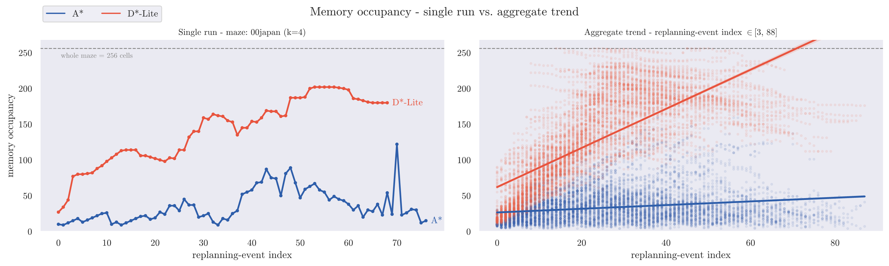

\begin{titlepage}
\centering
\includegraphics[width=0.5\textwidth]{res/logo_unibs.png}\par\vspace{1cm}
{\scshape\Large DIPARTIMENTO DI INGEGNERIA DELL'INFORMAZIONE\par}
\vspace{0.3cm}
{\large Corso di Laurea in Ingegneria Informatica\par}
\vspace{2cm}
{\large Relazione del progetto di Robotica\par}
\vspace{0.6cm}
{\LARGE\bfseries Maze Exploration Search Analysis \par}
\vspace{0.8cm}
{\large Anno di Corso 2025-2026\par}
\vfill

\begin{flushleft}
{\large\textbf{Docente del corso:}\par}
{\large Prof. Enrico Scala\par}
{\large Prof. Luigi Gargioni\par}
\end{flushleft}

\vspace{1cm}

\begin{flushright}
{\large\textbf{Studenti:}\par}
{\large Francesco Guarda\par}
{\large Andrea Moro\par}
\end{flushright}

\vfill

{\footnotesize
\textbf{Licensing Note}\\
This work is licensed under the Creative Commons Attribution 4.0 International License.
Copyright for components of this work owned by other than the authors and the
University of Brescia must be honoured.
}

\end{titlepage}

\tableofcontents
\clearpage

# Introduction

This project treats goal-directed maze exploration as an **online replanning problem**, in the classical Micromouse paradigm. The agent knows the start and goal cells in advance but not the maze layout, and must interleave sensing, (re)planning, and acting to reach the goal while minimizing exploration effort. It adopts the **freespace assumption**: every unexplored cell is optimistically treated as passable until a wall is sensed. A *replanning event* is triggered whenever new information invalidates the current plan.

This report evaluates two search algorithms: A\* (full replanning) versus D\*-Lite (incremental replanning), isolating the effect of *how* a plan is repaired when a new wall is discovered. Both run against a common exploration framework built for this comparison. A shared interface lets either algorithm drive the same sense-plan-act loop, and a headless extension of the MMS simulator makes fully automated, GUI-free evaluation at scale practical. Moreover this framework extends the classical center-goal Micromouse problem to Multi-goal exploration, providing controlled exploration effort through goal placement via a **detour index**, extended here to nested multi-goal scenarios. A full experimental campaign then provides a controlled comparison of the two algorithms across a corpus of 55 mazes and different multi-goal scenarios.

# Background

**The Micromouse problem and the MMS simulator.** The Micromouse competition tasks a small autonomous robot with exploring an unknown grid maze from a fixed start to a fixed goal region. This project uses `mms` (mackorone, 2024), which reproduces that setting through a GUI for visualization and a text-based `stdin`/`stdout` protocol for wall queries, moves, turns, and display commands. The interface's competition-faithful design, built-in visualization, and existing Python bindings motivated its adoption here, extended in §3.

{width=82%}

**Search under partial observability.** Under the freespace assumption, an agent plans as if every unsensed cell were open, then repairs its plan when a sensed wall proves otherwise. This is the optimistic-planning principle behind the D\* family of incremental replanners (Stentz, 1994). The report compares two heuristic search strategies built on that principle: A\* (Hart et al., 1968), the classical best-first baseline, and D\*-Lite (Koenig & Likhachev, 2002, 2005), designed explicitly to reuse previous search results rather than recursively resolve the whole problem from scratch.

# Methodology

## Exploration algorithms common Interface

`BaseAPI` is an abstract contract concerning wall sensing, movement, display and reset, decoupling an exploration algorithm from its I/O backend. `BaseAlgorithm` instead, implements the shared *sense* → *plan* → *act* → *log* loop on top of `BaseAPI`, together with goal resolution, given the diverse goal-placement options offered by the framework (Micromouse default centre area, detour-index based, explicit coordinates or random) and the metrics hooks common to every search algorithm. Adding a third algorithm to the proposed framework therefore means implementing one class against this interface, with no change to execution, logging, or evaluation tooling.

## Headless execution for automated evaluation

A second backend, `SimAPI`, implements the same `BaseAPI` contract entirely in memory, without running the MMS GUI process, enabling headless non-visual simulation. This lays as the primary foundation for large deterministic experimental campaigns, otherwise impractical under the manual GUI-based execution.

## Exploration algorithms

**A\*** treats every replanning event as an independent search. After each newly discovered wall invalidates the current plan, it rebuilds an open list and a closed list from scratch, rooted at the robot's current position, and expands nodes by increasing f = g + h until a goal is popped. Nothing from a previous event survives into the next one. Movement cost is *uniform* and multi-goal exploration greedily re-targets the nearest remaining goal once one is reached, discarding all information about the other goals as it restarts.

**D\*-Lite** instead keeps two values alive per cell across the whole episode: `g(s)`, the current best-known cost from `s` to the goal, and `rhs(s)`, a one-step lookahead equal to the cheapest neighbour's `g` plus its movement cost. A cell is *consistent* once `g(s) = rhs(s)`. The algorithm keeps every reachable cell consistent except where a change has just occurred. When a wall is newly confirmed, only the cells touching that edge have their `rhs` recomputed and enter the priority queue as inconsistent. Repair then propagates outward from those cells until consistency is restored, touching only the region the wall affects. Everywhere else, `g` and `rhs` remain untouched and are reused as-is in the next planning cycle. The search retires a reached goal, setting its `rhs` to infinity, and re-targets the next one without discarding this retained state.

The framework fixes **both** algorithms' heuristics to exploit *Manhattan distance*, as it is admissible and consistent and fits D\*-Lite's own incremental `km`-based heuristic update. Furthermore it has **constant complexity** O(1), and requires no recomputation as it stays valid across the whole episode. This grants that neither algorithm's node or time counts are confounded by heuristic-recomputation overhead.

## Multi-goal exploration

Given a set of goals both algorithms visit them in greedy nearest-goal order, though the search mechanics producing that order differ. A\*'s search is rooted at the current position and terminates at the first goal popped from its open list, discarding all partial information about the other goals once that episode ends. D\*-Lite's search is instead rooted at the *entire* remaining goal set simultaneously, with every unreached goal initialised at `rhs = 0`. Once the nearest goal is reached, the `g`/`rhs` state already built toward the others remains valid and is reused directly. This is an amplification, specific to multi-goal exploration, of the reuse advantage described in the aforementioned paragraph. With no goals specified, both algorithms fall back to the standard Micromouse 4-cell centre goal area, where first arrival ends the run.

## Modeling exploration effort: the detour index

For a reference cell and a candidate cell, the **detour index** is defined as the ratio between the true in-maze (BFS) distance and the Manhattan distance separating them. A cell that is topologically close yet remote within the maze thus yields a high detour index, rendering it highly deceptive and prone to misleading greedy planners operating under partial knowledge (Barthélemy, 2011; Gastner & Newman, 2006). 

In the multi-goal, detour-index-based placement procedure, the per-cell detour index is first computed relative to the agent's starting position, and the first goal is placed at the cell maximising this index. At each subsequent step, the detour index is recomputed relative to the start and to every previously placed goal, with only the *minimum* value retained for each cell. This ensures that the selection of each new goal accounts for deceptiveness not only with respect to the start but also with respect to all previously fixed goal locations. Figure 2 illustrates the resulting per-cell detour index at each placement step k = 1..4 for a representative maze, showing how the retained-minimum criterion progressively reshapes the score map as goals accumulate.

{width=90%}

This procedure yields a deterministic sequence of nested goals that are mutually misleading, thereby maximising exploration effort relative to one another, providing a controlled axis of *exploration effort*, which increases linearly with the amount k of placed goals.

# Experimental Evaluation

## Setup

The corpus comprises 55 standard Micromouse competition mazes (Weisberg), each 16×16 (256 cells), filtered to guarantee full connectivity from the start so that every goal is reachable and successful termination of exploration is thereby guaranteed. For each maze, four goal-count scenarios (k = 1..4) are placed automatically via detour-index placement (§3.5). The resulting headless batch campaign comprises **440 runs** in total, each logging run-level scalars together with a per-event replanning record, as detailed in the subsequent sections.

With the exception of wall-clock planning time, every metric is exactly reproducible across runs. The analysis presented below is therefore descriptive and paired, requiring no inferential statistics; planning time is the only quantity subject to genuine measurement noise.

## Goal-placement across the maze corpus

Although detour-index placement progressively intensifies exploration effort as k grows, Table 1 spans the resulting range of first-goal placements across a representative sample of the maze corpus and reveals that a high detour score can arise from two qualitatively different situations: goals that are genuinely remote *and* high-scoring, and goals whose high score reflects only their proximity to the start rather than any real difficulty. This start-proximity pattern recurs in 26 of the 55 mazes; Figure 2 illustrates one such instance, where the second placed goal sits immediately behind a wall close to the reference set.

| Maze | Manhattan dist. | Real (BFS) dist. | Detour score |
|---|---|---|---|
| 84japx | 1 | 7 | 7.0 |
| 2008japan | 11 | 71 | 6.5 |
| museum | 1 | 5 | 5.0 |
| 2009japan | 14 | 60 | 4.3 |

: First-goal (k=1) placement for four mazes: `84japx`, `2008japan`, `2009japan`, and `museum`; the second and last are genuinely remote, while first and third score highly because of start proximity.

## Replanning cost: nodes expanded and wall-clock planning time

D\*-Lite consistently expands between roughly two and three times fewer nodes than A\*, and accumulates a correspondingly lower cumulative planning time, on the order of two-and-a-half to three times less (Figure 3). D\*-Lite expands fewer nodes in 212 of the 220 matched (maze, k) pairs and achieves lower planning time in 219 of the 220 pairs. This outcome follows directly from the incremental-repair mechanism described in §3.3: because only the cells affected by a newly discovered wall are reprocessed, computational cost tracks the magnitude of the change rather than the size of the remaining problem as a whole.

{width=90%}

## Search-cost scaling: evidence for incremental reuse

A\*'s per-event search cost scales more steeply with residual distance to the goal than does D\*-Lite's, and this gap widens as k increases. Within the dense band of residual distances up to 30 cells, a linear regression of nodes expanded on residual distance shows A\*'s slope rising from approximately 1.8 at k = 1 to nearly 2.8 at k = 4, whereas D\*-Lite's remains comparatively flat. Pooled across all values of k, A\*'s slope is roughly three times steeper than D\*-Lite's (Figure 4). This provides direct empirical support for D\*-Lite's central claim (§3.3): repair cost scales with the *size of the region affected by a change*, rather than with the size of the whole remaining problem, whereas A\*'s from-scratch cost grows with the full remaining search space. Table 2 confirms the same divergence on a bin-by-bin basis.

{width=90%}

<!--
| Residual distance | $\mu_{\text{A*}}$ | $\text{ci}^{95\%}_{\text{A*}}$ | $\mu_{\text{D*-Lite}}$ | $\text{ci}^{95\%}_{\text{D*-Lite}}$ | Ratio |
|----|-----|-----|---|---|---|
| (0, 5] | 6.6 | [6.5, 6.7] | 4.7 | [4.6, 4.8] | 1.4× |
| (5, 10] | 13.5 | [13.3, 13.6] | 6.9 | [6.7, 7.0] | 2.0× |
| (10, 15] | 22.8 | [22.4, 23.1] | 9.1 | [8.7, 9.4] | 2.5× |
| (15, 20] | 34.8 | [33.7, 35.9] | 13.2 | [12.4, 14.0] | 2.6× |
| (20, 25] | 52.6 | [49.9, 55.3] | 20.0 | [17.1, 22.9] | 2.6× |
| (25, 30] | 77.7 | [70.2, 85.3] | 30.7 | [23.9, 37.4] | 2.5× |

: Mean nodes expanded with 95% confidence interval by residual-distance bin, restricted to the dense band used for the fit above (99.3% of all logged events).
-->

## Memory footprint of search structures

The two algorithms make opposite trade-offs between search cost and memory (Figure 5). In a single run of maze 00japan at k = 4, A\*'s combined open and closed set oscillates within a low band, resetting at every replanning event. D\*-Lite's working set, by contrast, climbs toward a plateau near 80% of the maze and remains there. This climb is not perfectly monotonic, newly discovered walls may reset cells `g` values to infinity, but the overall trajectory is unmistakably one of accumulation rather than reset. The pooled trend (Figure 5, right) confirms that this pattern holds across the corpus: D\*-Lite's occupancy rises steadily with event count, while A\*'s remains essentially flat.

Table 3 summarises this pattern across all runs. D\*-Lite's median peak occupancy is more than double A\*'s, and its median per-run mean occupancy is roughly four times higher. No A\* run's peak occupancy exceeds 75% of the maze, whereas 31 of the 220 D\*-Lite runs exceed 90%, and four fill the maze entirely. This reverses the ordering established in §4.3: A\* achieves its bounded memory footprint at the cost of repeated search, whereas D\*-Lite achieves cheap repair at the cost of retained state. Neither algorithm dominates outright.

{width=90%}

| Algorithm | Peak — median | Peak — $\sigma$ | Mean — median | Mean — $\sigma$ |
|---|---|---|---|---|
| A\* | 69.0 | 38.76 | 29.51 | 10.35 |
| D\*-Lite | 182.5 | 71.63 | 116.58 | 47.21 |

: Peak and per-run mean memory occupancy (cells, out of 256), median and standard deviation across all 220 runs per algorithm.

# Conclusions and Future Work

On the metrics that matter most, D\*-Lite's incremental repair consistently outperforms A\*'s from-scratch replanning: it expands fewer nodes per event and accumulates less planning time overall, with the gap widening as replanning distance increases. This advantage, however, comes at the cost of memory. Neither algorithm dominates outright; the preferable choice depends on which resource is scarcer, and on micromouse-class embedded hardware, this is not a foregone conclusion.

The main limitation of this evaluation is that the detour index recurrently biases goal placement toward the start rather than calibrating absolute exploration effort. Introducing a start-proximity correction to the metric would represent the most direct next step. A second promising direction is to extend the framework to additional algorithms, weighted and anytime variants in particular, since incorporating a new algorithm requires implementing only a single class against this interface (§3.1). The full implementation, maze corpus, and experimental logs are available in the project repository (Guarda & Moro, 2026).

\clearpage

# References {-}

- **MMS simulator:** mackorone, *mms — A Micromouse Simulator*, v1.2.0, MIT License, GitHub (2024).
- **Maze corpus:** J. Weisberg, *Micromouse Maze Collection*, tcp4me.com.
- **A\*:** P. E. Hart, N. J. Nilsson, and B. Raphael, "A Formal Basis for the Heuristic Determination of Minimum Cost Paths," *IEEE Transactions on Systems Science and Cybernetics*, 4(2), 100–107, 1968.
- **D\* / the freespace assumption:** A. Stentz, "Optimal and Efficient Path Planning for Partially-Known Environments," *Proc. IEEE International Conference on Robotics and Automation (ICRA)*, 1994.
- **D\*-Lite:** S. Koenig and M. Likhachev, "D\* Lite," *Proc. AAAI/IAAI*, 476–483, 2002; and S. Koenig and M. Likhachev, "Fast Replanning for Navigation in Unknown Terrain," *IEEE Transactions on Robotics*, 21(3), 354–363, 2005.
- **Detour index / route factor:** M. Barthélemy, "Spatial Networks," *Physics Reports*, 499(1–3), 1–101, 2011; M. T. Gastner and M. E. J. Newman, "The Spatial Structure of Networks," *European Physical Journal B*, 49(2), 247–252, 2006.
- **Rob-26-MazeSolver repository:** F. Guarda and A. Moro, *Robotica 2026 - Maze Solver Project*, software, MIT License, GitHub (released 2026-07-29).

\vfill

\hrule
\vspace{0.5em}

\begin{small}
\textbf{Acknowledgements.}
The authors acknowledge the use of large language model (LLM)-based artificial intelligence tools during the preparation of this report. These tools were used exclusively to improve the clarity and readability of the manuscript and to assist with source code development and debugging. All technical content, implementation decisions, experimental methodology, and conclusions remain the sole responsibility of the authors.
\end{small}