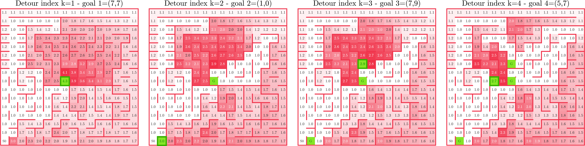
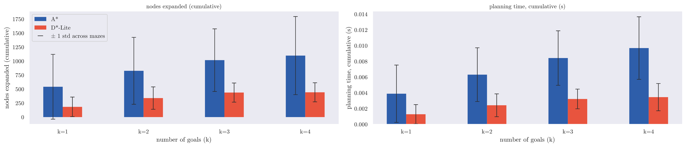
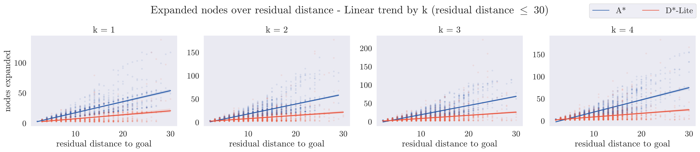

\begin{titlepage}
\centering
\includegraphics[width=0.5\textwidth]{res/logo_unibs.png}\par\vspace{1cm}
{\scshape\Large DIPARTIMENTO DI INGEGNERIA DELL'INFORMAZIONE\par}
\vspace{0.3cm}
{\large Corso di Laurea in Ingegneria Informatica\par}
\vspace{2cm}
{\large Relazione del progetto di Robotica\par}
\vspace{0.6cm}
{\LARGE\bfseries Maze Exploration Search Analysis \par}
\vspace{0.8cm}
{\large Anno di Corso 2025-2026\par}
\vfill

\begin{flushleft}
{\large\textbf{Docente del corso:}\par}
{\large Prof. Enrico Scala\par}
{\large Prof. Luigi Gargioni\par}
\end{flushleft}

\vspace{1cm}

\begin{flushright}
{\large\textbf{Studenti:}\par}
{\large Francesco Guarda\par}
{\large Andrea Moro\par}
\end{flushright}

\vfill

{\footnotesize
\textbf{Licensing Note}\\
This work is licensed under the Creative Commons Attribution 4.0 International License.
Copyright for components of this work owned by other than the authors and the
University of Brescia must be honoured.
}

\end{titlepage}

\tableofcontents
\clearpage

# Introduction

This project treats goal-directed maze exploration as an **online replanning problem**, in the classical Micromouse paradigm. The agent knows the start and goal cells in advance but not the maze layout, and must interleave sensing, (re)planning, and acting to reach the goal while minimizing exploration effort. It adopts the **freespace assumption**: every unexplored cell is optimistically treated as passable until a wall is sensed. A *replanning event* is triggered whenever new information invalidates the current plan.

This report evaluates A\* (full replanning) against D\*-Lite (incremental replanning), isolating the effect of *how* a plan is repaired when a new wall is discovered. Both run against a common exploration framework built for this comparison. A shared interface lets either algorithm drive the same sense-plan-act loop, and a headless extension of the MMS simulator makes fully automated, GUI-free evaluation at scale practical. Multi-goal exploration is a first-class capability of this framework, not a special case of single-goal search. Exploration difficulty is manufactured deliberately, through where goals are placed rather than through choice of maze, via a **detour index** extended here to nested multi-goal scenarios. A 440-run controlled comparison then evaluates D\*-Lite as an *incremental* search algorithm that reuses prior search effort across replanning events, not merely as an alternative heuristic to A\*.

# Background

**The Micromouse problem and the MMS simulator.** The Micromouse competition tasks a small autonomous robot with exploring an unknown grid maze from a fixed start to a fixed goal region. This project uses `mms` (mackorone, 2024), which reproduces that setting through a GUI for visualization and a text-based `stdin`/`stdout` protocol for wall queries, moves, turns, and display commands. The interface's competition-faithful design, built-in visualization, and existing Python bindings motivated its adoption here, extended in §3.

{width=90%}

**Search under partial observability.** Under the freespace assumption, an agent plans as if every unsensed cell were open, then repairs its plan when a sensed wall proves otherwise — the optimistic-planning principle behind the D\* family of incremental replanners (Stentz, 1994). This report compares two heuristic search strategies built on that principle: A\* (Hart et al., 1968), the classical best-first baseline, and D\*-Lite (Koenig & Likhachev, 2002, 2005), designed explicitly to reuse previous search results rather than resolve the whole problem from scratch. Both are described mechanistically in §3.3.

# Methodology

## A common interface for exploration algorithms

`BaseAPI` is an abstract contract — wall sensing, movement, display, reset — decoupling an exploration algorithm from its I/O backend. `BaseAlgorithm` implements the shared sense → plan → act → log loop on top of it, together with goal resolution (an explicit list, random goals, or a default centre area) and the metrics hooks common to every concrete algorithm. Adding a third algorithm to this project therefore means implementing one class against this interface, with no change to execution, logging, or evaluation tooling.

## Headless execution for automated evaluation

A second backend, `SimAPI`, implements the same `BaseAPI` contract entirely in memory, without the MMS GUI process. This is what makes a large deterministic batch campaign practical: the same algorithm code runs unmodified under either backend. A cross-check against the real MMS GUI confirmed behavioural equivalence before the campaign in §4 ran headlessly at scale.

## Exploration algorithms

**A\*** treats every replanning event as an independent search. After each newly discovered wall invalidates the current plan, it rebuilds an open list and a closed list from scratch, rooted at the robot's current position, and expands nodes by increasing f = g + h until a goal is popped. Nothing from a previous event survives into the next one. Movement cost is 1 per traversable edge. Multi-goal exploration greedily re-targets the nearest remaining goal once one is reached, discarding all information about the other goals as it restarts.

**D\*-Lite** instead keeps two values alive per cell across the whole episode: `g(s)`, the current best-known cost from `s` to the goal, and `rhs(s)`, a one-step lookahead equal to the cheapest neighbour's `g` plus one. A cell is *consistent* once `g(s) = rhs(s)`. The algorithm keeps every reachable cell consistent except where a change has just occurred. When a wall is newly confirmed, only the cells touching that edge have their `rhs` recomputed and enter the priority queue as inconsistent. Repair then propagates outward from those cells until consistency is restored, touching only the region the wall affects. Everywhere else, `g` and `rhs` remain untouched and are reused as-is in the next planning cycle. The search retires a reached goal, setting its `rhs` to infinity, and re-targets the next one without discarding this retained state.

The experimental campaign (§4) fixes **both** algorithms to the Manhattan heuristic. It is admissible and consistent, costs O(1) per query rather than a fresh graph search, and matches D\*-Lite's own incremental `km`-based heuristic update, so neither algorithm's node or time counts are confounded by heuristic-recomputation overhead. The comparison therefore stays isolated to *how* each algorithm repairs its plan.

## Multi-goal exploration

Goals may be an explicit list, a random sample, or an automatically placed set (§3.5). Both algorithms visit them in greedy nearest-goal order, though the search mechanics producing that order differ. A\*'s search is rooted at the current position and terminates at the first goal popped from its open list, discarding all partial information about the other goals once that episode ends. D\*-Lite's search is instead rooted at the *entire* remaining goal set simultaneously, with every unreached goal initialised at `rhs = 0`. Once the nearest goal is reached, the `g`/`rhs` state already built toward the others remains valid and is reused directly. This is an amplification, specific to multi-goal exploration, of the reuse advantage described in §3.3. With no goals specified, both algorithms fall back to the standard Micromouse 4-cell centre goal area, where first arrival ends the run. This default is not used by the experimental campaign, where every scenario is placed automatically (§3.5).

## Modeling exploration difficulty: the detour index

For a reference cell and a candidate cell, the **detour index** is the ratio of true in-maze (BFS) distance to straight-line (Manhattan) distance. A cell that looks close but is actually far behind walls scores highest, exactly the configuration that defeats a greedy planner working from a partial map — the *route factor*/*circuity* of spatial-network analysis (Barthélemy, 2011; Gastner & Newman, 2006). The first goal maximises detour from the start. Each additional goal maximises the *minimum* detour over the start and every previously placed goal, so a k-goal scenario stays jointly deceptive rather than just individually so. Scenarios are **nested**: a k-goal scenario's first j goals equal the j-goal scenario's goals. The metric is used here to manufacture exploration effort through goal placement, not to grade maze difficulty (§4.1). The same 55-maze corpus is reused at every k. Where goals are placed within it, not a choice of "harder" mazes, scales the work asked of both algorithms. Its normalisation favours goals close to the start (§5).

# Experimental Evaluation

## Setup

The corpus is 55 standard Micromouse competition mazes (Weisberg), all 16×16 (256 cells), filtered to guarantee full connectivity from the start so every goal is reachable. Four goal-count scenarios are placed automatically per maze, k = 1..4, by detour-index placement (§3.5). The full factorial, headless batch campaign — 2 algorithms × 55 mazes × 4 scenarios — produced **440 runs**, each logging run-level scalars and a per-event replanning record (nodes expanded, planning time, residual distance to goal, memory occupancy).

Every metric except wall-clock planning time is exactly reproducible run to run, because the campaign is a full census of the (algorithm × maze × scenario) space rather than a sample. The analysis below is therefore descriptive and paired rather than inferential: it reports no p-values or resampling. Planning time is the only quantity with genuine measurement noise. Both algorithms are complete searches under the freespace assumption, so reaching every goal on a fully connected maze is guaranteed rather than a finding. All 440 runs did so.

## Goal-placement difficulty across the maze corpus

Detour-index placement progressively intensifies exploration effort as k grows, rather than manufacturing increasingly difficult individual goals. Because placement is nested (§3.5), every k-goal scenario shares the same first goal, and each subsequent goal stays comparably deceptive relative to what is already known rather than becoming harder in an absolute sense. Aggregate exploration effort therefore grows with k across the whole corpus (§4.3–4.5), even though no single goal grows harder than the last. Table 1 spans the resulting range of first-goal placements across the corpus, from genuinely remote, high-scoring mazes to a case where a high score reflects only the goal's proximity to the start rather than real difficulty — a pattern that recurs in 26 of the 55 mazes (§5). Figure 2 shows the score map goal placement maximises at each step, k = 1..4, for maze 2009japan: high-scoring cells sit immediately behind walls close to the reference set.

| Maze | Manhattan dist. | Real (BFS) dist. | Detour score |
|---|---|---|---|
| zigzag | 3 | 107 | 35.7 |
| 2015japan | 3 | 75 | 25.0 |
| 2017apec | 5 | 99 | 19.8 |
| museum | 1 | 5 | 5.0 |

: First-goal (k=1) placement for four mazes spanning the score range: zigzag, 2015japan and 2017apec are genuinely remote as well as high-scoring; museum scores comparably high only because its Manhattan distance is 1. Every nested k $\ge$ 1 scenario shares this same first goal.

## Replanning cost: nodes expanded and wall-clock planning time

D\*-Lite expands **2.3–3.0× fewer nodes** than A\* at every k and accumulates **2.6–3.1× less** cumulative planning time (Figure 3) — a consistent win on both measures, not a trade-off: fewer nodes in 212 of the 220 matched (maze, k) pairs, lower time in 219 of 220. This is the direct, expected consequence of the incremental-repair mechanism in §3.3: it reprocesses only the cells touched by a newly discovered wall, so cost tracks the size of the change rather than the size of the whole remaining problem. Nodes expanded is the algorithm-intrinsic, implementation-independent measure of search effort. Planning time is useful corroboration but remains hardware- and implementation-dependent in principle. Here, the two agree on every ordering.

## Search-cost scaling: evidence for incremental reuse

A\*'s per-event search cost scales more steeply with residual distance to the goal than D\*-Lite's, and this gap widens as k grows. Within the dense band of residual distance $\le$ 30 cells (99.3% of the 18,176 logged events), a linear regression of nodes expanded on residual distance shows A\*'s slope rising from 1.83 at k=1 to 2.75 at k=4, while D\*-Lite's stays close to flat, from 0.66 to 0.81 over the same range. Pooled across all k, A\*'s slope (2.32) is 3.1× D\*-Lite's (0.76) (Figure 4). This is direct empirical support for D\*-Lite's central claim (§3.3): repair cost scales with the *size of the region a change affects*, not with the size of the whole remaining problem, while A\*'s from-scratch cost grows with the full remaining search space. Table 2 confirms the same divergence bin by bin. The ratio climbs from 1.4× nearest the goal to 2.6× by 15–20 cells away, then holds rather than widening further, so D\*-Lite's relative advantage is bounded and predictable rather than unbounded with distance.

{width=100%}

| Residual distance | $\mu_{\text{A*}}$ | $\text{ci}^{95\%}_{\text{A*}}$ | $\mu_{\text{D*-Lite}}$ | $\text{ci}^{95\%}_{\text{D*-Lite}}$ | Ratio |
|----|-----|-----|---|---|---|
| (0, 5] | 6.6 | [6.5, 6.7] | 4.7 | [4.6, 4.8] | 1.4× |
| (5, 10] | 13.5 | [13.3, 13.6] | 6.9 | [6.7, 7.0] | 2.0× |
| (10, 15] | 22.8 | [22.4, 23.1] | 9.1 | [8.7, 9.4] | 2.5× |
| (15, 20] | 34.8 | [33.7, 35.9] | 13.2 | [12.4, 14.0] | 2.6× |
| (20, 25] | 52.6 | [49.9, 55.3] | 20.0 | [17.1, 22.9] | 2.6× |
| (25, 30] | 77.7 | [70.2, 85.3] | 30.7 | [23.9, 37.4] | 2.5× |

: Mean nodes expanded with 95% confidence interval by residual-distance bin, restricted to the dense band used for the fit above (99.3% of all logged events); three sparser bins beyond 30 cells (13–42 events each) are excluded as too noisy to support a reliable estimate.

## Memory footprint of search structures

The two algorithms trade cost for statelessness in opposite directions (Figure 5). On a single run of maze 00japan at k=4 — the run whose D\*-Lite peak sits closest to the corpus median at that k — A\*'s open+closed set oscillates in a low band and ends close to where it started (peak 122, final 15, of 256 cells). It resets every replanning event. D\*-Lite's working set — cells currently holding a finite `g` or `rhs` — instead climbs toward a plateau near 80% of the maze and stays there (peak 202, final 180 on the same run). The climb is not perfectly monotonic: a newly discovered wall resets some cells' `g` to infinity until a new shortest path re-supports them. The trajectory, however, is unmistakably one of accumulation rather than reset. The pooled trend (Figure 5, right) confirms this holds across the corpus, not just the run shown: D\*-Lite's occupancy rises steadily with event count while A\*'s stays flat.

Table 3 summarises this across all 220 runs per algorithm. D\*-Lite's median peak occupancy is **2.6× A\*'s** (182.5 vs. 69.0 cells), and its median per-run mean is **4.0× A\*'s** (116.58 vs. 29.51). No A\* run's peak exceeds 75% of the maze, while 31 of 220 D\*-Lite runs exceed 90% and four fill it completely. The penalty is mildest at k=1 (1.7×, since short runs end before the working set saturates) and settles at 2.4–2.9× from k=2 on. This reverses the ordering of §4.3: A\* buys its bounded footprint at the price of repeated search, while D\*-Lite buys cheap repair at the price of retained state. Neither algorithm dominates outright.

{width=100%}

| Algorithm | Peak — median | Peak — $\sigma$ | Mean — median | Mean — $\sigma$ |
|---|---|---|---|---|
| A\* | 69.0 | 38.76 | 29.51 | 10.35 |
| D\*-Lite | 182.5 | 71.63 | 116.58 | 47.21 |

: Peak and per-run mean memory occupancy (cells, out of 256), median and standard deviation across all 220 runs per algorithm.

# Conclusions and Future Work

On the metrics that matter, D\*-Lite's incremental repair consistently outperforms A\*'s from-scratch replanning: fewer nodes expanded per event and less cumulative planning time overall, with the gap widening as replanning distance grows (§4.3–4.4). D\*-Lite pays for that advantage in memory: its working set grows toward roughly 70% of the maze and stays there, against a bounded, resetting footprint for A\* (§4.5). Neither algorithm dominates outright. The right choice depends on which resource is scarcer, computation or memory. On micromouse-class embedded hardware, that is not a foregone conclusion.

The main limitation of this evaluation is the detour index's own normalisation, which biases goal placement toward the start rather than calibrating absolute difficulty (§4.2; full discussion in the repository). A start-proximity correction to the metric would remove this bias and is the most direct next step. A second direction extends the shared exploration interface to additional algorithms, weighted or anytime variants in particular, since adding one now requires implementing only a single class against it (§3.1). The full implementation, maze corpus, and experimental logs are available in the project repository (Guarda & Moro, 2026).

\clearpage

# References {-}

- **MMS simulator:** mackorone, *mms — A Micromouse Simulator*, v1.2.0, MIT License, GitHub (2024).
- **Maze corpus:** J. Weisberg, *Micromouse Maze Collection*, tcp4me.com.
- **A\*:** P. E. Hart, N. J. Nilsson, and B. Raphael, "A Formal Basis for the Heuristic Determination of Minimum Cost Paths," *IEEE Transactions on Systems Science and Cybernetics*, 4(2), 100–107, 1968.
- **D\* / the freespace assumption:** A. Stentz, "Optimal and Efficient Path Planning for Partially-Known Environments," *Proc. IEEE International Conference on Robotics and Automation (ICRA)*, 1994.
- **D\*-Lite:** S. Koenig and M. Likhachev, "D\* Lite," *Proc. AAAI/IAAI*, 476–483, 2002; and S. Koenig and M. Likhachev, "Fast Replanning for Navigation in Unknown Terrain," *IEEE Transactions on Robotics*, 21(3), 354–363, 2005.
- **Detour index / route factor:** M. Barthélemy, "Spatial Networks," *Physics Reports*, 499(1–3), 1–101, 2011; M. T. Gastner and M. E. J. Newman, "The Spatial Structure of Networks," *European Physical Journal B*, 49(2), 247–252, 2006.
- **Rob-26-MazeSolver repository:** F. Guarda and A. Moro, *Robotica 2026 - Maze Solver Project*, software, MIT License, GitHub (released 2026-07-29).

\vfill

\hrule
\vspace{0.5em}

\begin{small}
\textbf{Acknowledgements.}
The authors acknowledge the use of large language model (LLM)-based artificial intelligence tools during the preparation of this report. These tools were used exclusively to improve the clarity and readability of the manuscript and to assist with source code development and debugging. All technical content, implementation decisions, experimental methodology, and conclusions remain the sole responsibility of the authors.
\end{small}