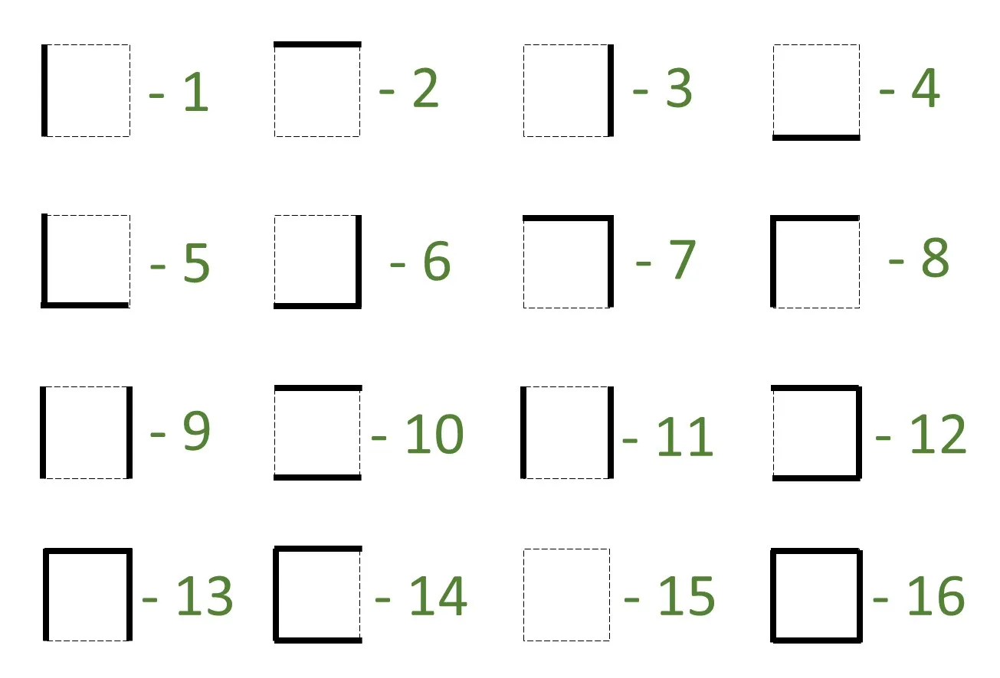

# Proposta progetto di Robotica

## 1. Obiettivo del progetto

Nelle competizioni di Micromouse, l'obiettivo principale consiste nell'esplorare e mappare parzialmente o completamente il `maze` **online** (**full exploration**), per poi identificare il percorso minimo **offline** verso il goal a partire dallo stato iniziale, entro i limiti della porzione esplorata. Nell'ambito di questo progetto, ci collochiamo in uno scenario differente: l'obiettivo dell'agente è raggiungere il goal (di cui si assume di conoscere le coordinate), riducendo al minimo la fase di esplorazione del `maze` e privilegiando l'efficienza e l'efficacia nell'individuazione di un percorso, anche sub-ottimo (evitando pertanto la **full exploration**).

In dettaglio, l'obiettivo del progetto è implementare e testare tre strategie di esplorazione del `maze` — wall-following, flood fill e A* — e confrontarne le prestazioni in termini di efficienza ed efficacia nell'individuazione di un percorso verso il goal. Poiché l'agente è orientato al raggiungimento del goal piuttosto che alla mappatura completa, la ricerca **offline** del percorso minimo non rientra tra gli obiettivi operativi dell'agente, ma viene comunque calcolata e impiegata come indicatore di qualità della soluzione trovata, secondo le modalità descritte nella sezione [4](#4-risultati-attesi-e-metriche-di-valutazione).

Le strategie saranno valutate nei termini di efficienza ed efficacia definiti nella sezione [4](#4-risultati-attesi-e-metriche-di-valutazione), in relazione a diverse configurazioni del `maze` a complessità crescente e a casi critici/sintomatici (ad esempio, labirinti con dead-end, loop e isole), selezionati dalla collezione ufficiale di labirinti per le competizioni di Micromouse (ad esempio [`maze-collection`](https://www.tcp4me.com/mmr/mazes/)), come descritto nella sezione [3](#3-scenari-di-valutazione).

Di seguito è riportata la struttura prevista per la relazione finale:

**Indice della relazione**:
1. Introduzione
2. Descrizione del problema Micromouse, dell'interfaccia del simulatore `mms` e delle specifiche implementative adottate (con eventuali adattamenti apportati)
3. Descrizione degli algoritmi di esplorazione implementati (wall-following, flood fill, A*), con dettagli sulla gestione dei casi limite (dead-end, loop, selezione del prossimo obiettivo di esplorazione)
4. Descrizione degli scenari di valutazione (`maze` a complessità incrementale e casi critici/sintomatici) e delle metriche di valutazione adottate
5. Report dei risultati, con visualizzazioni grafiche e confronto critico tra le strategie in relazione alle metriche definite
6. Conclusioni e possibili sviluppi futuri

## 2. Componenti software

- **Simulatore di `maze`**: [`mms`](https://github.com/mackorone/mms) — comunica con l'algoritmo tramite `stdin`/`stdout`; il linguaggio di implementazione scelto è **Python**, compatibile con l'interfaccia fornita dal simulatore.
- **Collezione di labirinti**: [`maze-collection`](https://www.tcp4me.com/mmr/mazes/) — labirinti in formato standard per le competizioni ufficiali di Micromouse.
- **Ricerca offline del percorso minimo**: algoritmo BFS (Breadth-First Search) o Dijkstra applicato alla mappa interna costruita dall'agente e alla mappa completa del `maze`, per il calcolo degli indicatori di qualità del percorso.

## 3. Scenari di valutazione

Gli algoritmi saranno testati su un insieme di labirinti di complessità crescente, selezionati dalla collezione `maze-collection`. Nello specifico, si prevede di impiegare almeno **nove labirinti**, raggruppati in tre livelli di difficoltà:

- **Livello 1 — semplice**: labirinti di dimensione standard (16x16) o ridotta (es. 8×8 o 10×10) privi di isole, con struttura prevalentemente ad albero (no loop), adatti a verificare il corretto funzionamento di base degli algoritmi;
- **Livello 2 — intermedio**: labirinti di dimensione standard (16×16) con la presenza di loop e dead-end, che mettono alla prova le strategie di backtracking e la selezione del prossimo obiettivo di esplorazione;
- **Livello 3 — complesso**: labirinti di dimensione standard (16x16) con isole, loop multipli e strutture sintomatiche, in grado di evidenziare i limiti del wall-following e di valutare la robustezza di flood fill e A*.

La selezione dei labirinti mira a coprire scenari diversificati, al fine di evidenziare punti di forza e criticità di ciascuna strategia. In particolare, si osserverà come il wall-following fallisca nei labirinti con isole (pareti disconnesse dal perimetro), a differenza di flood fill e A*, che non dipendono dalla connettività delle pareti.

> La difficoltà dei labirinti sarà valutata come proposto nell'articolo [Using search algorithm statistics for assessing maze and puzzle difficulty](https://www.sciencedirect.com/science/article/pii/S1875952125000059) che sfrutta la cardinalità della **closed-list** (numero di nodi espansi) nella ricerca del percorso minimo mediante BFS come indice **euristico** di *difficoltà* del maze. La quantificazione degli intervalli di cardinalità della closed-list per ciascun livello di difficoltà sarà effettuata in fase di test, al fine di selezionare labirinti rappresentativi per ciascun livello.

## 4. Risultati attesi e metriche di valutazione

Le seguenti metriche saranno impiegate per confrontare le strategie di esplorazione:

- **Efficienza di esplorazione**: numero totale di mosse (passi e rotazioni) necessarie per raggiungere il goal a partire dallo stato iniziale.
- **Efficacia di esplorazione**: numero di celle distinte visitate al momento del raggiungimento del goal, espresso anche come percentuale rispetto alla dimensione totale del `maze`.
- **Numero totale di celle visitate**: numero complessivo di visite a celle durante l'esplorazione, contando ogni accesso anche se la stessa cella viene visitata più volte. Questa metrica è distinta dalla precedente e consente di valutare il grado di ridondanza nell'esplorazione.
- **Percorso minimo sulla mappa interna**: lunghezza del percorso minimo calcolato **offline** (tramite BFS/Dijkstra) sulla mappa parziale costruita dall'agente al momento del raggiungimento del goal.
- **Percorso minimo sul `maze` completo**: lunghezza del percorso minimo calcolato **offline** sulla mappa completa del `maze`, disponibile a posteriori. Confrontando questa metrica con la precedente si ottiene una misura della qualità della mappa interna costruita dall'agente.
- **Tempo di completamento della simulazione**: tempo totale impiegato dall'agente per raggiungere il goal a partire dallo stato iniziale.
- **Robustezza**: valutata come tasso di successo (percentuale di scenari in cui l'agente raggiunge il goal) e come degradazione relativa delle metriche di efficienza ed efficacia al crescere della complessità del `maze`. Un algoritmo robusto dovrebbe mantenere un tasso di successo del 100% e una degradazione contenuta delle prestazioni sui labirinti complessi.

Per ogni simulazione, le metriche saranno raccolte in file di log in formato `json` o `csv`. Ciascun file conterrà i valori consuntivi di tutte le metriche, nonché la rappresentazione interna della mappa costruita dall'agente, codificata secondo due matrici `R × C` (dove R e C sono rispettivamente il numero di righe e di colonne del `maze`):

1. **Matrice delle pareti**: per ogni cella esplorata, un valore intero da `1` a `16` rappresenta la configurazione dei muri circostanti, secondo il dizionario riportato nella seguente figura . Le celle mai visitate sono codificate con il valore `0`.
2. **Matrice delle visite**: per ogni cella, un valore intero non negativo che indica il numero di volte in cui la cella è stata visitata — `0` per le celle mai visitate, $n \ge 1$ per le celle visitate `n` volte.

A partire dalla matrice delle visite sarà possibile generare **heatmap** dell'esplorazione del `maze` e **barplot** comparativi del numero totale di celle visitate per strategia. Verranno inoltre salvati i percorsi minimi individuati **offline** sia sulla mappa interna dell'agente sia sulla mappa completa del `maze`, per consentire un confronto qualitativo tra i due.

In merito ai risultati attesi: si prevede che A* guidi l'agente verso percorsi di costo inferiore, ma che possa richiedere frequenti ricicli e ri-pianificazioni al momento della scoperta di nuovi muri, risultando potenzialmente meno efficiente in termini di numero di mosse rispetto al flood fill. Quest'ultimo, basandosi su una propagazione BFS dei valori di distanza aggiornati dinamicamente, tende a navigare in modo più diretto verso il goal, con minori revisioni del piano. Il wall-following risulterà la strategia più semplice e prevedibile, ma anche la meno efficace e la meno robusta, in particolare nei labirinti con isole. Chiaramente, i risultati dipenderanno dalla specifica configurazione del `maze` e dalle scelte implementative adottate.

## 5. Suddivisione del lavoro

Il lavoro sarà organizzato in fasi sequenziali, con attività parallele nella fase di implementazione, al fine di garantire una distribuzione equa e una collaborazione efficace tra i membri del gruppo:

- **Fase 1 — Studio e familiarizzazione** (tutti i membri): studio del problema Micromouse, dell'interfaccia del simulatore `mms` e del formato dei file di labirinto; configurazione dell'ambiente di sviluppo e test di un algoritmo di esempio.
- **Fase 2 — Implementazione degli algoritmi** (suddivisa tra i membri):
  - membro A: algoritmo wall-following e modulo di gestione della mappa interna (`maze map`);
  - membro B: algoritmo flood fill;
  - membro B: algoritmo A* (online) con euristica ammissibile (e.g., distanza di Manhattan).
- **Fase 3 — Integrazione e logging** (tutti i membri): integrazione dei moduli, implementazione del sistema di logging delle metriche in formato `json`/`csv` e verifica del corretto funzionamento su labirinti semplici.
- **Fase 4 — Valutazione sperimentale** (tutti i membri): esecuzione delle simulazioni sull'insieme di labirinti selezionati, raccolta dei dati e generazione delle visualizzazioni (heatmap, barplot, confronto percorsi minimi).
- **Fase 5 — Analisi e stesura della relazione** (tutti i membri): analisi critica dei risultati, confronto tra le strategie rispetto alle metriche definite e redazione della relazione finale.
