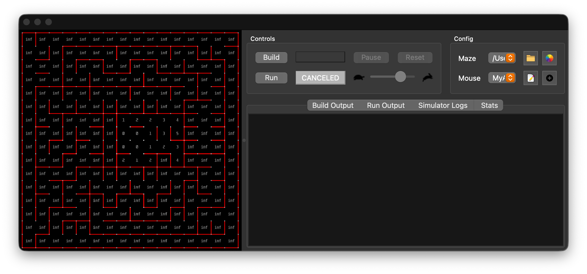
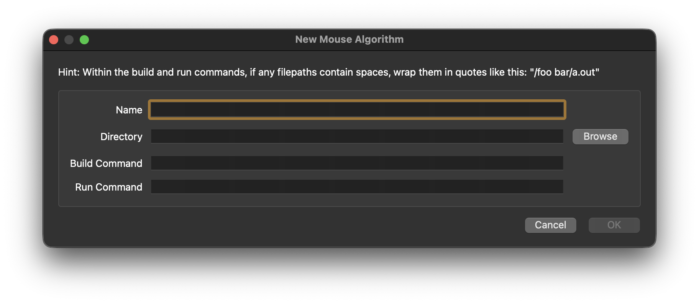
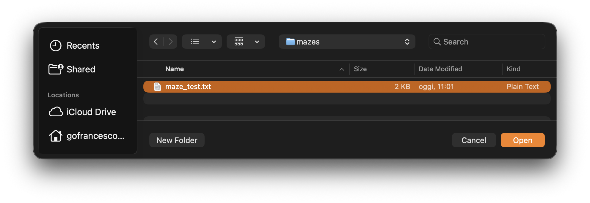

# MMS Integration Guide

This document explains how to set up and run the Micromouse algorithms using the **MMS simulator**.

## Prerequisites

Before proceeding, ensure you have completed the **Installation** section in [README.md](README.md#installation):
- ✓ Python 3.8+ installed
- ✓ Virtual environment (`.venv`) created and activated
- ✓ Dependencies installed via `pip install -r requirements.txt`
- ✓ Project structure initialized (Python modules in `src/algorithms/`, maze files in `mazes/`)

## Step 1: Download and Install the Simulator

1. Download the [MMS simulator binary](https://github.com/mackorone/mms/releases) for your operating system.
2. Extract the archive into a folder (e.g., `~/mms/` or `./app/` in the project root).

### macOS-Specific Step

On macOS, you may encounter a quarantine error:
```
"mms.app" is damaged and can't be opened. You should move it to the Trash.
```

To fix this, remove the quarantine attribute:
```bash
cd ~/mms  # or wherever you extracted the simulator
xattr -d com.apple.quarantine mms.app
```

## Step 2: Launch the Simulator

Run the MMS simulator:
```bash
open mms.app              # macOS
```

## Step 3: Configure an Algorithm

1. In the MMS window, click the **`+`** button to add a new algorithm.
   

2. Fill in the **New Mouse Algorithm** dialog:
   - **Name**: Algorithm identifier (e.g., `flood_fill`, `wall_following`, `astar`)
   - **Directory**: Full path to the repository root (e.g., `/path/to/Rob-26-MazeSolver`)
   - **Build command**: Leave blank (Python is interpreted, not compiled)
   - **Run command**: See the section below

### Run Command Format

The run command instructs MMS how to invoke your algorithm. Use the template:

```bash
.venv/bin/python -m src.algorithms.[algorithm_name]
```

Replace `[algorithm_name]` with the algorithm module name (e.g., `flood_fill`, `wall_following`, `astar`).

> **Using conda instead of `.venv`?** The `.venv/bin/python` path above only applies to a `venv`-created environment. If you use conda, use the full path to your conda environment's Python interpreter instead:
>
> ```bash
> /path/to/miniconda/base/envs/[env_name]/bin/python -m src.algorithms.[algorithm_name]
> ```
>
> To find your exact interpreter path, activate your conda environment and run `which python`.

**Optional flags:** You can pass command-line arguments defined in the algorithm's `argparse` configuration:

```bash
.venv/bin/python -m src.algorithms.flood_fill --log
```

Common flags:
- `--log`: Enable logging of exploration metrics to `results/logs/`
- `--verbose`: Print debug output to stderr during exploration

**Example configuration:**

   

## Step 4: Select a Maze

1. Click the **Maze** button in the MMS window.
2. Navigate to `mazes` and select a maze file (`.txt` format).
   

## Step 5: Run the Simulation

1. Click the **Run** button to start the simulation.
2. Watch the robot explore the maze in real-time.
3. The **Stats** tab shows exploration metrics (distance, turns, effective distance, score).
4. The simulation will end according to the algorithm's termination logic (e.g., reaching the goal, timeout, or max moves).

This runs all algorithms on all mazes and logs metrics to `results/logs/` without requiring MMS to be running.

## Troubleshooting

| Issue | Solution |
|-------|----------|
| "Module not found" error | Ensure you are running from the repo root and the virtual environment is activated |
| Algorithm hangs or crashes | Check `stderr` output; run locally with `scripts/batch_run.py` to get detailed error messages |
| Maze file not found | Verify the path is correct and the file has a `.txt` extension |
| On macOS: "mms.app is damaged" | Run `xattr -d com.apple.quarantine mms.app` in the simulator directory |
