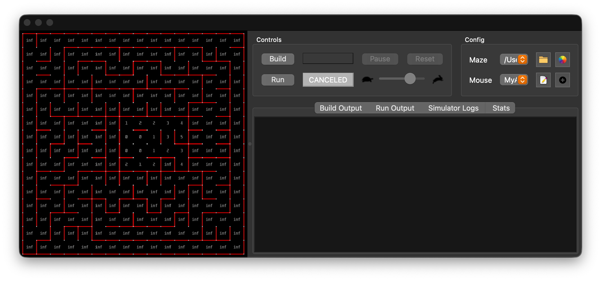
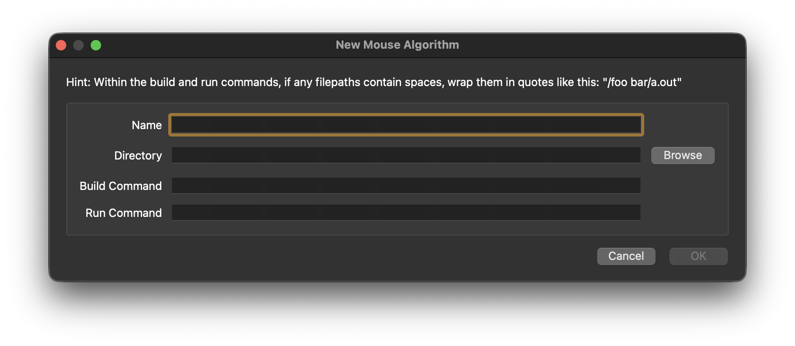
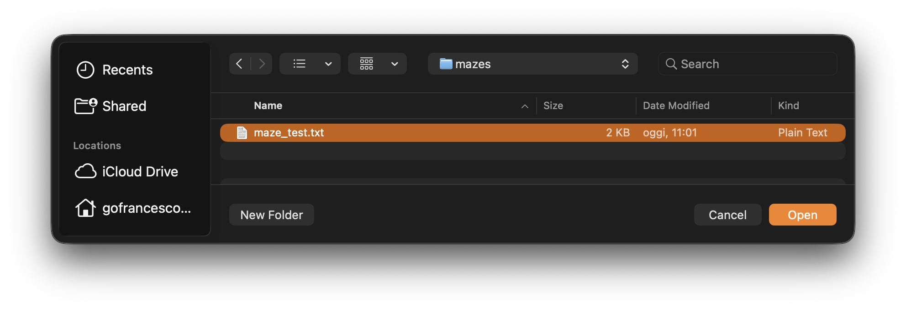

# MMS Simulator Guide

Setup and usage guide for running this project's algorithms — `AStarExplorer` and `DStarLiteExplorer` — inside the [MMS Micromouse simulator](https://github.com/mackorone/mms).

> [!NOTE]
> This guide covers the **GUI simulator** only. For headless, no-GUI batch evaluation across many mazes, see `experiments/run_batch.py` instead — it drives the same algorithms through `SimAPI` rather than MMS.

## Prerequisites

Complete the **Installation** section of the [root README](../README.md#installation) first:
- ✓ Install Python 3.8+
- ✓ Create and activate a virtual environment (`.venv`)
- ✓ Install dependencies via `pip install -r requirements.txt`

## Step 1: Install the Simulator

1. Download the [MMS release](https://github.com/mackorone/mms/releases) for your OS.
2. Extract it into the project's [`app/`](../app/) directory, or the repository root.

> [!NOTE]
> **Keep the simulator inside the project.** MMS resolves relative paths in the Run command against its own working directory, not the algorithm's configured Directory field. Extracting it to `app/` or the repository root makes that directory the repo root, so the relative interpreter path used throughout this guide (`.venv/bin/python`) resolves without changes. If you install it elsewhere, use the interpreter's **full path** in the Run command instead (see [Run command](#run-command)).

> [!IMPORTANT]
> **macOS only:** opening `mms.app` may fail with *"mms.app is damaged and can't be opened."* This is Gatekeeper blocking an unsigned download, not a corrupt file — clear the quarantine attribute:
> ```bash
> cd app  # or the repository root, wherever you extracted mms.app
> xattr -d com.apple.quarantine mms.app
> ```

## Step 2: Launch the Simulator

```bash
open mms.app   # macOS
```

On Linux/Windows, run the extracted executable directly.

## Step 3: Configure the Algorithm

In the MMS window, click **`+`** to add a new algorithm.



Fill in the **New Mouse Algorithm** dialog:

| Field | Value |
|---|---|
| **Name** | Algorithm identifier, e.g. `astar` or `dstar_lite` |
| **Directory** | Absolute path to the repository root (e.g., `/path/to/Rob-26-MazeSolver`)|
| **Build command** | *(leave blank — Python is interpreted, not compiled)* |
| **Run command** | See [Run command](#run-command) below |



### Run command

`run.py` is the MMS entry point: it talks to the real simulator via `MmsAPI` and is what the **Run command** field must invoke.

```bash
.venv/bin/python run.py --algo <astar|dstar_lite> [goals] [options]
```

> [!NOTE]
> **Windows?** The virtual environment's interpreter lives at a different path. Substitute it in every command below:
>
> | Platform | Interpreter path |
> |---|---|
> | macOS / Linux | `.venv/bin/python` |
> | Windows | `.venv\Scripts\python.exe` |

**Goals:** pick at most one of the following parameters; if none is given, the algorithm stops as soon as the first cell of the maze's centre 2×2 area is reached:

   | Flags | Places |
   |---|---|
   | *(none)* | Default centre-area goal |
   | `--goal X Y` *(repeatable)* | Explicit goal list, e.g. `--goal 3 3 --goal 0 3` |
   | `--n-goals N` `[--seed S]` | `N` random goal cells |
   | `--auto-goals MAZE` `[-k N]` | Deceptive goals by detour index, `N` of them (default `4`) — see [below](#automatic-goal-placement---auto-goals) |

**Options:**

| Flag | Default | Description |
|---|---|---|
| `--heuristic {min_path,manhattan}` | `min_path` | Planning heuristic. `astar` only — `dstar_lite` always uses its own Manhattan-to-current-position heuristic. See [`src/algorithms/README.md`](../src/algorithms/README.md) |
| `--maze-name NAME` | auto-detected | Maze name recorded in the log filename. MMS never reports the loaded file, so this is only needed for manual-goal runs — `--auto-goals` already names the maze |
| `--output-dir DIR` | `results/logs/` | Base directory for the exported JSON log |
| `--no-log` | off | Skip writing the JSON log (stderr diagnostics still print) |

**Examples:**

```bash
.venv/bin/python run.py --algo astar
.venv/bin/python run.py --algo dstar_lite --goal 3 3 --goal 0 3
.venv/bin/python run.py --algo astar --n-goals 4 --seed 42
.venv/bin/python run.py --algo astar --auto-goals 2015japan -k 4
```

On completion, `run.py` writes a JSON metrics log to `results/logs/<goal-count>/<algo>/` — the same schema produced by headless runs, so GUI and batch results are directly comparable. See [`src/metrics/README.md`](../src/metrics/README.md) for the export schema, unless `--no-log` was passed.

> [!NOTE]
> **Using conda instead of `.venv`?** Replace the interpreter path with your conda environment's Python:
> ```bash
> /path/to/miniconda/envs/<env_name>/bin/python run.py --algo <astar|dstar_lite>
> ```
> Activate the environment and run `which python` to find the exact path.

### Automatic goal placement (`--auto-goals`)

`--auto-goals MAZE [-k N]` places `N` goals (default `4`) by detour index — cells that look close but are actually far behind walls, the most deceptive to a planner working from a partial map — computed from the start cell `(0, 0)`. See [`tools/README.md`](../tools/README.md) for the placement algorithm.

`MAZE` resolves to a file in `mazes/txt/` (bare name, `.txt` optional), or a path — absolute, or relative to the repo root — for mazes kept elsewhere:

```bash
--auto-goals 2015japan            # -> mazes/txt/2015japan.txt
--auto-goals 2015japan.txt        # -> mazes/txt/2015japan.txt
--auto-goals mazes/maze_test.txt  # -> path relative to the repo root
```

> [!WARNING]
> **Naming the maze correctly is your responsibility.** MMS's stdin/stdout protocol reports only the maze's width and height, never which file the GUI has loaded — `run.py` has to be told, and cannot verify it beyond a dimension check:
> ```text
> error: --auto-goals: '/…/mazes/txt/2015japan.txt' is 16x16, but the simulator
> reports 8x8 — the maze loaded in the GUI is not the one named here
> ```
> This only catches size mismatches. Two mazes of the *same* dimensions are indistinguishable over the protocol — if you switch to a different same-size maze in the GUI without updating `--auto-goals`, the run proceeds with goals placed for the wrong layout.

## Step 4: Select a Maze

1. Click the **Maze** button in the MMS window.
2. Navigate to `mazes/txt` and select a maze file (`.txt` format — see [`mazes/README.md`](../mazes/README.md) for the format spec).



> [!TIP]
> Browse the full maze set — and copy names for `--auto-goals` — with the [online maze viewer](https://htmlpreview.github.io/?https://github.com/FrancescoGuarda/Rob-26-MazeSolver/blob/main/mazes/index.html).

## Step 5: Run a Session

1. Click **Run** to start the simulation.
2. A **legend window** opens in its own process, mapping on-screen colors and text (e.g. `f-XXXh-YYY`, `g-XXXr-YYY`) to their meaning for the selected algorithm. Starting a new run auto-closes any legend window left over from the previous one.
3. The **Stats** tab tracks exploration metrics (distance, turns, effective distance, score) live.
4. Wall discoveries and replanning events stream to **stderr** — one `[WALL] (x, y) n e s w` line per sensing event (`_` = no wall) and one `[REPLAN] ...` line per replan, with `cost_ratio`/`time_ms` rounded to 2 decimals. stdout is reserved for the MMS protocol.
5. The run ends once the goal condition is satisfied (for the default centre-area goal, as soon as its first cell is reached). The GUI then clears all non-goal decoration, leaving only goal cells marked: reached goals in green (`g`, labelled with 1-based reach order for a true multi-goal run), unreached default-centre cells in dark green (`G`).


## Troubleshooting

| Issue | Solution |
|---|---|
| "Module not found" error | Run from the repo root with the virtual environment activated |
| Run command fails with "No such file or directory" for `.venv/bin/python` | `mms.app` isn't inside the project (`app/` or repo root), so the relative interpreter path doesn't resolve — move it there (Step 1) or switch the Run command to the interpreter's full path |
| Algorithm hangs or crashes | Check the **Run Output**/stderr panel; reproduce locally with `experiments/run_batch.py` for a detailed traceback |
| Maze file not found | Verify the path and that the file has a `.txt` extension |
| `--auto-goals` dimension error | The maze named in the Run command doesn't match the one loaded in the GUI — update `--auto-goals` to match |
| macOS: "mms.app is damaged" | Run `xattr -d com.apple.quarantine mms.app` in the simulator directory |
